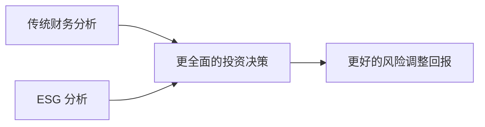
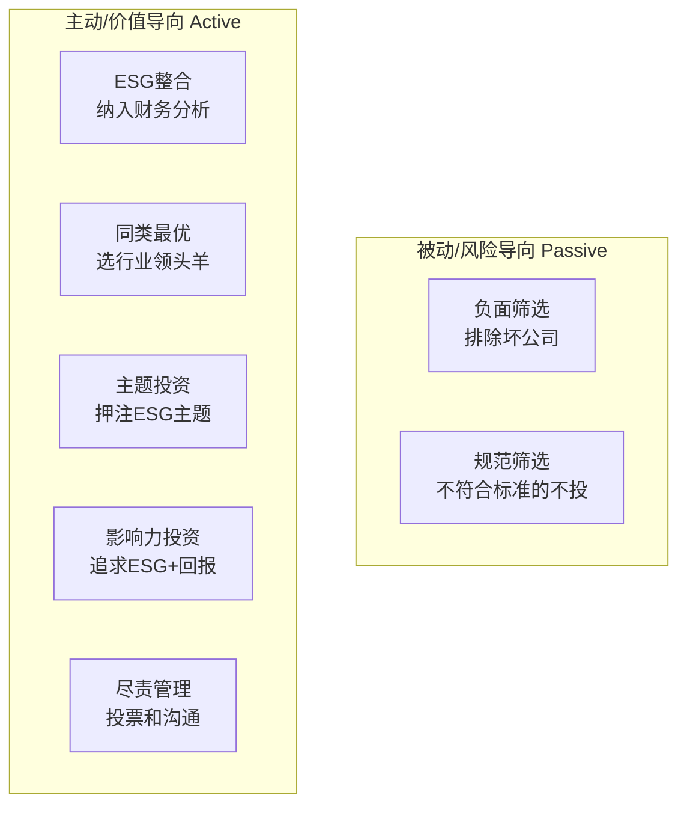

# 模块 1：ESG 投资简介 | Module 1: Introduction to ESG Investing

> **考试权重：~10%** | 这是整个课程的基础模块，帮助你建立 ESG 投资的知识框架。
>
> 零基础学员请务必吃透本模块，后续所有内容都建立在此之上。

---

## 学习目标

完成本模块后，你应该能够：

1. 解释 ESG 投资的概念及其在金融行业中的重要性
2. 区分不同类型的负责任投资（RI）策略
3. 识别 ESG 生态系统中的主要参与方及其角色
4. 理解 ESG 投资从 SRI 到现代 ESG 整合的历史演变
5. 说出关键的 ESG 相关国际组织和框架

---

## 1. 什么是 ESG？

### 1.1 ESG 的定义

**ESG** 是 Environmental（环境）、Social（社会）和 Governance（治理）三个英文单词的首字母缩写，代表评估企业在可持续发展方面表现的三个核心维度。

| 维度 | 关注内容 | 举例 |
|---|---|---|
| **E — 环境** | 企业对自然环境的影响 | 碳排放、水资源使用、废弃物管理、生物多样性 |
| **S — 社会** | 企业与人和社会的关系 | 劳工权益、供应链标准、产品安全、社区关系 |
| **G — 治理** | 企业如何被管理和监督 | 董事会结构、高管薪酬、股东权利、反腐败 |

> **💡 关键理解：** ESG 不是"做好事"的道德评判，而是一套评估企业**长期风险管理和价值创造能力**的分析框架。

### 1.2 为什么要关注 ESG？（Why ESG Matters）

在传统财务分析之外，ESG 因素为投资者提供了额外的风险视角：

- **环境风险**：气候变化政策可能导致化石燃料公司资产贬值（搁浅资产）
- **社会风险**：劳工丑闻可能引发消费者抵制，品牌价值一夜蒸发
- **治理风险**：糟糕的公司治理可能导致欺诈、腐败甚至破产（如安然事件）



### 1.3 外部性（Externality）概念 ⭐

**外部性**是 ESG 投资中最基础的经济学概念。

> 外部性 = 企业活动的成本或收益**没有反映在**其财务报表中，而是由社会或环境承担。

- **负外部性（Negative Externality）**：工厂排污 → 社会承担污染治理成本 → 但工厂不为此买单
- **正外部性（Positive Externality）**：企业建公园 → 社区居民受益 → 但企业未获额外收入

ESG 投资的核心逻辑之一就是：**将外部性内部化**——通过资本配置引导企业为外部性负责。

---

## 2. 负责任投资（Responsible Investment, RI）的演变

### 2.1 历史发展脉络

负责任投资不是新概念，它已经发展了几十年：

| 阶段 | 时期 | 特征 |
|---|---|---|
| **道德投资**（Ethical Investing） | 18-20 世纪 | 宗教团体拒绝投资烟草、酒精、赌博（"罪恶股票"） |
| **社会责任投资**（SRI） | 1960s-1990s | 反越战、反种族隔离运动推动价值观导向投资 |
| **ESG 整合**（ESG Integration） | 2000s 至今 | 从"排除坏公司"转向"系统性评估所有公司的 ESG 风险" |
| **影响力投资**（Impact Investing） | 2010s 至今 | 主动追求可量化的社会/环境正面影响 + 财务回报 |

### 2.2 关键里程碑

| 年份 | 事件 | 意义 |
|---|---|---|
| **1971** | Pax World Fund 成立 | 第一只 SRI 共同基金，避开越南战争相关股票 |
| **1992** | 联合国环境与发展会议（里约峰会） | 首次将可持续发展提上全球议程 |
| **1997** | 全球报告倡议组织（GRI）成立 | 建立了最早的可持续发展报告框架 |
| **2000** | 联合国全球契约（UNGC）启动 | 推动企业在人权、劳工、环境、反腐败方面的承诺 |
| **2004** | "Who Cares Wins" 报告发布 | 联合国与金融机构联合提出 ESG 概念 |
| **2006** | PRI（负责任投资原则）启动 | 投资者承诺将 ESG 纳入投资决策的六大原则 |
| **2015** | 巴黎协定 + SDGs 通过 | 全球气候目标和 17 个可持续发展目标确立 |
| **2021** | ISSB 成立 | 统一全球可持续发展报告标准 |

> **⚠️ 考试提示：** 2004 年 "Who Cares Wins" 是 ESG 一词的起源；2006 年 PRI 是 ESG 制度化的里程碑。这两个年份常考。

### 2.3 从 SRI 到 ESG：关键区别

| 维度 | SRI（传统社会责任投资） | ESG（现代 ESG 整合） |
|---|---|---|
| **出发点** | 价值观/道德信念 | 风险管理与价值创造 |
| **方法** | 负面筛选（排除不想要的）为主 | 多维度分析，整合入估值 |
| **对财务回报的看法** | 愿意接受可能更低的回报 | 追求风险调整后的更好回报 |
| **受众** | 有特定价值观的个人和机构 | 主流投资者，包括养老基金等 |
| **典型代表** | 宗教基金、慈善基金会 | BlackRock, 挪威主权基金 |

---

## 3. ESG 投资的主要策略

### 3.1 七大负责任投资策略（PRI 分类法）

| # | 策略 | 英文 | 说明 |
|---|---|---|---|
| 1 | **负面/排除性筛选** | Negative / Exclusionary Screening | 排除特定行业或公司（如烟草、军工、化石燃料） |
| 2 | **规范导向筛选** | Norms-Based Screening | 仅投资符合国际规范（如 UNGC）的公司 |
| 3 | **ESG 整合** | ESG Integration | 将 ESG 因素系统纳入财务分析和投资决策 |
| 4 | **同类最优/正面筛选** | Best-in-Class / Positive Screening | 选择每个行业中 ESG 表现排名靠前的公司 |
| 5 | **主题投资** | Thematic Investing | 围绕特定 ESG 主题构建组合（如清洁能源、水资源） |
| 6 | **影响力投资** | Impact Investing | 追求可量化的正面社会/环境影响 + 财务回报 |
| 7 | **积极所有权/尽责管理** | Active Ownership / Stewardship | 通过投票、沟通影响公司改善 ESG 表现 |

### 3.2 策略对比记忆



> **💡 记忆技巧：** 从"排除"到"整合"到"主动影响"，是 ESG 策略成熟度的进阶路径。

---

## 4. ESG 生态系统：关键参与方

### 4.1 主要参与者

| 参与方 | 英文 | 角色 |
|---|---|---|
| **资产所有者** | Asset Owners | 拥有资产的机构（养老基金、保险公司、主权基金、家族办公室） |
| **资产管理人** | Asset Managers | 受委托进行投资决策的机构 |
| **公司/发行人** | Companies / Issuers | 出售股票或债券以融资的企业 |
| **监管机构** | Regulators | 制定 ESG 信息披露和分类规则 |
| **标准制定者** | Standard Setters | 制定报告框架和披露标准（GRI, SASB, ISSB, TCFD） |
| **评级机构** | Rating Agencies | 提供 ESG 评分和数据（MSCI, Sustainalytics, ISS） |
| **服务提供商** | Service Providers | 提供 ESG 数据、咨询、鉴证等服务 |
| **NGOs / 民间组织** | NGOs & Civil Society | 倡导和监督企业在 ESG 方面的表现 |

### 4.2 资产所有者 → 资产管理人 → 被投资公司：委托链

```
资产所有者（养老基金等）
    │  设定投资授权(Investment Mandate)，包含 ESG 要求
    ▼
资产管理人
    │  进行 ESG 整合分析和投资决策
    ▼
被投资公司
    │  披露 ESG 信息，回应投资者沟通
```

> **⚠️ 考试提示：** 投资授权中是否包含 ESG 约束，是决定 ESG 能否被贯彻的**第一道关口**。常考"mandate"的角色。

---

## 5. 关键国际组织和框架

### 5.1 必知组织速览

| 组织/框架 | 全称 | 一句话定位 |
|---|---|---|
| **PRI** ⭐ | Principles for Responsible Investment | 全球最大的投资者 ESG 承诺倡议（2006年，联合国支持） |
| **UNGC** | UN Global Compact | 企业承诺遵守人权、劳工、环境、反腐败十大原则 |
| **UNEP FI** | UN Environment Programme Finance Initiative | 联合国与金融业在可持续发展上的合作平台 |
| **TCFD** ⭐ | Task Force on Climate-related Financial Disclosures | 全球最权威的气候信息披露框架 |
| **GRI** | Global Reporting Initiative | 使用最广泛的可持续发展报告标准 |
| **SASB** | Sustainability Accounting Standards Board | 分行业的 ESG 披露标准（已并入 ISSB） |
| **ISSB** ⭐ | International Sustainability Standards Board | IFRS 基金会下的全球可持续披露基准制定者 |
| **SDGs** | Sustainable Development Goals | 联合国 2015 年制定的 17 个到 2030 年全球发展目标 |
| **ICMA** | International Capital Market Association | 制定绿色/社会/可持续债券原则 |

### 5.2 PRI 六大原则（必记！）⭐

PRI 的六大原则是考试必考内容。签署 PRI 的机构承诺：

1. **将 ESG 问题纳入投资分析和决策过程**
2. **成为积极所有者，将 ESG 纳入所有权政策和实践**
3. **寻求被投资实体对 ESG 问题的适当披露**
4. **推动投资行业对 PRI 的接受和实施**
5. **共同努力提高 PRI 实施的有效性**
6. **报告 PRI 实施的活动和进展**

> **记忆技巧：** ①分析决策 → ②所有权 → ③披露 → ④推广 → ⑤协作 → ⑥报告

### 5.3 主要报告框架对比

| 框架 | 视角 | 受众 | 特点 |
|---|---|---|---|
| **GRI** | 企业→社会的影响 | 多方利益相关者 | 广泛、全面，最通用 |
| **SASB** | ESG→企业财务的影响 | 投资者 | 分行业、侧重财务重要性 |
| **TCFD** | 气候→企业财务的影响 | 投资者/债权人 | 聚焦气候、四支柱结构 |
| **ISSB** | 综合，对标 IFRS | 全球资本市场 | 正在成为全球基准 |

---

## 6. ESG 投资的驱动因素和挑战

### 6.1 为什么 ESG 投资在增长？

| 驱动因素 | 说明 |
|---|---|
| **监管推动** | 欧盟 SFDR、英国 Stewardship Code、各国强制披露要求 |
| **客户需求** | 千禧一代和女性投资者对可持续投资的偏好更强 |
| **风险管理** | 气候和社会风险证明能实质影响财务表现 |
| **长期回报** | 研究显示 ESG 表现好的公司长期风险调整后回报不低于传统公司 |
| **受托责任演进** | 越来越多法域将 ESG 纳入受托责任的定义 |

### 6.2 ESG 投资面临的主要挑战

| 挑战 | 说明 |
|---|---|
| **数据质量** | ESG 数据不一致、不完整、缺乏标准化 |
| **评级分歧** | 不同评级机构对同一公司的 ESG 评分可能差异巨大 |
| **漂绿风险** | 部分产品夸大 ESG 属性误导投资者 |
| **短期利益冲突** | ESG 投入需要时间，但市场关注每季度业绩 |
| **定义混乱** | "ESG""可持续""负责任""绿色"等术语缺乏统一定义 |
| **专业人才短缺** | 同时懂金融和 ESG 的专业人士稀缺 |

---

## 7. 本章重点总结

### 🔥 高频考点

1. **PRI 六大原则**的内容和意义
2. **ESG 一词的起源**："Who Cares Wins"（2004年）
3. **七种负责任投资策略**的区分（尤其是负面筛选 vs ESG 整合 vs 影响力投资）
4. **外部性**概念及其在 ESG 投资中的角色
5. **TCFD、ISSB**是什么及其与 GRI/SASB 的区别
6. **资产所有者**在推动 ESG 中的核心角色（投资授权）
7. **SRI vs ESG**：传统社会责任投资与现代 ESG 整合的关键区别

### 📝 关键定义速查

| 术语 | 一句话定义 |
|---|---|
| ESG | 从环境、社会、治理三个维度评估企业的框架 |
| 负责任投资 (RI) | 将 ESG 因素纳入投资决策和所有权管理的总称 |
| 外部性 | 企业活动对社会/环境造成但未内部化为成本的影响 |
| 尽责管理 (Stewardship) | 投资者通过投票和沟通积极监督影响公司 |
| 漂绿 (Greenwashing) | 夸大或虚假宣传 ESG 表现 |
| 搁浅资产 (Stranded Assets) | 因气候政策等因素提前贬值或失效的资产 |

---

## 8. 零基础学习建议

1. **先把术语表过一遍**：花 30 分钟浏览 [ESG 核心术语表](../glossary.md)，标记不熟悉的术语重点学习
2. **理解"为什么"先于"是什么"**：本模块关注 ESG 投资存在的**理由**，而非具体操作技巧
3. **记住关键年份**：2004（ESG 概念诞生）、2006（PRI 启动）、2015（巴黎协定/SDGs）、2021（ISSB 成立）
4. **能区分 7 种策略**：考试常通过选择题区分不同策略，要能根据描述判断属于哪种
5. **英文术语必须掌握**：考试是全英文的，建议用英文术语辅助记忆

---

*下一步：[模块 2：环境因素](../notes/module-02-environmental/README.md)*
